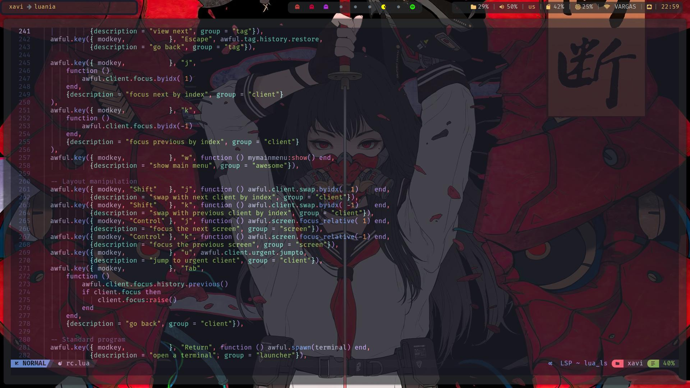

# My Humble Rice

Im using awesome as my window manager cause i found it easy and fun when customize it uses a lua file to config which is rc.lua, you can find it in .config/awesome/rc.lua or in /etc/xdg/awesome/rc.lua

## Programs

I use kitty as my terminal and you can install it with the following command
~~~
sudo pacman -S kitty
~~~
As my bar i use polybar and you can install it with the following command
~~~
sudo pacman -S polybar
~~~
If you cant find the config file wich is conf.ini at .config/polybar/conf.ini you can find it at /etc/polybar/config.ini

You also must install picom to get the transparency background, border corners and other stuff you may wanna configurate so install picom with the following command
~~~
sudo pacman -S picom
~~~

## Starship

For my bash promt im using starship wich i liked when i first saw it so to install it is simple, just run the following command
~~~
curl -sS https://starship.rs/install.sh | sh
~~~

then you have to add this line to your bash 
~~~
eval "$(starship init bash)"
~~~

if this doesn't work for you then see the starship page at https://starship.rs/guide/#%F0%9F%9A%80-installation
